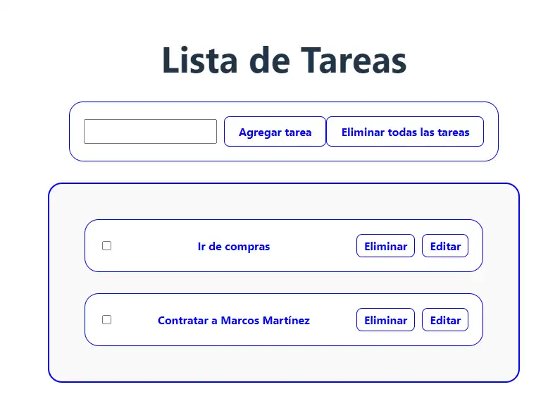

# Task-List

## Introducción
**Task-List** es una solución web diseñada para la creación y gestión de listas de tareas. 
Esta aplicación fue desarrollada como proyecto final del curso React JS de UTN. Dada la limitación de tiempo, el diseño no está completamente perfeccionado; sin embargo, cumple con todos los requisitos del curso, incluyendo puntos adicionales. Además, se han incorporado características adicionales que, aunque quizás no eran estrictamente necesarias para una aplicación de esta escala, demuestran una comprensión profunda de los conceptos de React.

  Vista Previa:

  

## Especificaciones

  Especificaciones y requisitos necesarios para utilizarla:

  - Especificaciones:
    - "Autor": "Martinez Marcos, "
    - "Servidor por defecto": "http://localhost:3016"
    - "Visual Studio Code": "1.83.0"
    - "GIT": "2.40.1"
    - "Lenguaje": "JavaScript"
    - "FrameWork": "React JS"
    - "S.O": "Windows 10pro"
  - Requerimientos :
    - "Node JS": "20.10.0"
  - Scripts:
    - "dev": "Inicia el servidor con nodemon",
     - "start": "Inicia el servidor con node"
  - Dependencias:
    "react": "18.2.0",
    "react-dom": "18.2.0",
    "react-router-dom": "6.19.0"
  - Dependencies de desarrollo:
    "@types/react": "^18.2.15",
    "@types/react-dom": "^18.2.7",
    "@vitejs/plugin-react": "^4.0.3",
    "eslint": "^8.54.0",
    "eslint-config-standard": "^17.1.0",
    "eslint-plugin-import": "^2.29.0",
    "eslint-plugin-n": "^16.3.1",
    "eslint-plugin-promise": "^6.1.1",
    "eslint-plugin-react": "^7.33.2",
    "eslint-plugin-react-hooks": "^4.6.0",
    "eslint-plugin-react-refresh": "^0.4.3",
    "vite": "^4.4.5"

  Clonar el repositorio e instalar dependencias.

  ```shell
  # Clona el repositorio  
  git clone https://github.com/Martinez-Marcos/Task-List.git
  cd Task-List
  npm install
  ```